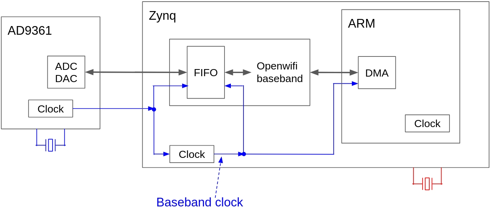

# openwifi-hw


**openwifi:** Linux mac80211 compatible full-stack IEEE802.11/Wi-Fi design based on SDR (Software Defined Radio).

[[Introduction](#Introduction)]
[[Build FPGA](#Build-FPGA)]
[[Modify IP cores](#Modify-IP-cores)]
[[Simulate IP cores](#Simulate-IP-cores)]

## Introduction

This repository includes Hardware/FPGA design. To be used together with openwifi repository (driver and software tools).

Openwifi code has dual licenses. [AGPLv3](https://github.com/open-sdr/openwifi/blob/master/LICENSE) is the opensource license. For non-opensource and advanced feature license, please contact Filip.Louagie@UGent.be. Openwifi project also leverages some 3rd party modules. It is user's duty to check and follow licenses of those modules according to the purpose/usage. You can find [an example explanation from Analog Devices](https://github.com/analogdevicesinc/hdl/blob/master/LICENSE) for this compound license conditions. [[How to contribute]](https://github.com/open-sdr/openwifi-hw/blob/master/CONTRIBUTING.md).

**Pre-compiled FPGA files:** boards/**$BOARD_NAME**/sdk/ has FPGA bit file, ila .ltx file (if ila inserted) and other initilization files.

Environment variable **BOARD_NAME** options:
- **zc706_fmcs2** ([Xilinx ZC706 board](https://www.xilinx.com/products/boards-and-kits/ek-z7-zc706-g.html) + [FMCOMMS2/3/4](https://www.analog.com/en/design-center/evaluation-hardware-and-software/evaluation-boards-kits/eval-ad-fmcomms2.html))
- **zed_fmcs2** ([Xilinx zed board](https://www.xilinx.com/products/boards-and-kits/1-8dyf-11.html) + [FMCOMMS2/3/4](https://www.analog.com/en/design-center/evaluation-hardware-and-software/evaluation-boards-kits/eval-ad-fmcomms2.html)) -- Vivado license **NOT** needed
- **adrv9364z7020** ([ADRV9364-Z7020 + ADRV1CRR-BOB](https://www.analog.com/en/design-center/evaluation-hardware-and-software/evaluation-boards-kits/adrv9364-z7020.html)) -- Vivado license **NOT** needed
- **adrv9361z7035** ([ADRV9361-Z7035 + ADRV1CRR-BOB/FMC](https://www.analog.com/en/design-center/evaluation-hardware-and-software/evaluation-boards-kits/ADRV9361-Z7035.html))
- **zc702_fmcs2** ([Xilinx ZC702 board](https://www.xilinx.com/products/boards-and-kits/ek-z7-zc702-g.html) + [FMCOMMS2/3/4](https://www.analog.com/en/design-center/evaluation-hardware-and-software/evaluation-boards-kits/eval-ad-fmcomms2.html)) -- Vivado license **NOT** needed
- **antsdr** ([MicroPhase](https://github.com/MicroPhase/) enhanced ADALM-PLUTO SDR. [Notes](boards/antsdr/notes.md)) -- Vivado license **NOT** needed
- **zcu102_fmcs2** ([Xilinx ZCU102 board](https://www.xilinx.com/products/boards-and-kits/ek-u1-zcu102-g.html) + [FMCOMMS2/3/4](https://www.analog.com/en/design-center/evaluation-hardware-and-software/evaluation-boards-kits/eval-ad-fmcomms2.html))

## Build FPGA

* Pre-conditions: 
  * Xilinx Vivado (with SDK and HLS) 2018.3 (Vivado Design Suite - HLx Editions - 2018.3  Full Product Installation)
  * Install the evaluation license of [Xilinx Viterbi Decoder](https://www.xilinx.com/products/intellectual-property/viterbi_decoder.html) into Vivado.
  * Ubuntu 18/20 LTS release (We test in these OS. Other OS might also work.)
  * Install [git lfs](https://git-lfs.github.com/) (For Ubuntu: sudo apt install git-lfs)

* Prepare Analgo Devices HDL library (only run once):
```
export XILINX_DIR=your_Xilinx_install_directory
(Example: export XILINX_DIR=/opt/Xilinx. The Xilinx directory should include sth like: Downloads, SDK, Vivado, xic)
./prepare_adi_lib.sh $XILINX_DIR
```
* Prepare Analgo Devices specific ip (only run once for each board you have):
```
export BOARD_NAME=your_board_name
(Example: export BOARD_NAME=zc706_fmcs2)
./prepare_adi_board_ip.sh $XILINX_DIR $BOARD_NAME
(Don't need to wait till the building end. When you see "Building ABCD project [...", you can stop it.)
```
* Get the openofdm_rx into ip directory (only run once after openofdm is udpated):
```
./get_ip_openofdm_rx.sh
```
* Launch Vivado:
```
cd openwifi-hw/boards/$BOARD_NAME/
source $XILINX_DIR/Vivado/2018.3/settings64.sh
vivado
```
* In Vivado:
```
source ./ip_repo_gen.tcl
(Generating ip_repo from ip design. Will take a while.)
source ./openwifi.tcl
Click "Generate Bitstream" in the Vivado GUI.
(Will take a while)
File --> Export --> Export Hardware... --> Include bitstream --> OK
File --> Launch SDK --> OK, then close SDK
```
* In Linux, store the FPGA files to a specific directory:
```
cd openwifi-hw/boards
./sdk_update.sh $BOARD_NAME
```
* Add the FPGA files to git (only if you want and know the actual repo you want commit to):
```
git add $BOARD_NAME/sdk/*
git commit -m "new fpga img for openwifi (or comments you want to make)"
git push
```
[git lfs](https://git-lfs.github.com/) must be installed for **system_top.bit** and **system.hdf** before git add (avoid too big repo!)

## Modify IP cores

IP core project files are in "ip/ip_name" directory. "ip_name" example: xpu, tx_intf, etc. Source the .tcl script in ip/ip_name from the Vivado GUI, you can create the IP project and do necessary work (modification, simulation, etc.) on it. After the IP design change, start from "source ./ip_repo_gen.tcl" in the board directory (Build FPGA section) to integrate your modified IP to the board FPGA design.

If your IP modification is complicated and encounter error while running ip_repo_gen.tcl, you should check, understand and modify the ip_repo_gen.tcl accordingly.

**Change the baseband clock:**



By default, 100MHz baseband clock is used. You can change the baseband clock by changing the NUM_CLK_PER_US at the beginning of openwifi.tcl. Available options:  240/100MHz for zcu102; 100/200MHz for zc706 and adrv9361z7035; 100MHz for the rest. Then re-run openwifi.tcl to create the new FPGA project.

## Simulate IP cores

* Create the ip core project in Vivado. To achieve this, you need to follow the previous section till you execute "source ./ip_name.tcl" in Vivado
* Normally you should see the top level testbench (..._tb.v) of that ip core in the Vivado "Sources" window (take openofdm_rx as example):

        Sources --> Simulation Sources --> sim_1 --> dot11_tb
* To run the simulation, click "Run Simulation" --> "Run Behavoiral Simulation" under the "SIMULATION" in the "PROJECT MANAGER" window. It will take quite long time for the 1st time run due to the sub-ip-core compiling. Fortunately the sub-ip-core compiling is a time consuming step that occurs only one time.
* When the previous step is finished, you should see a simulation window displays many variable names and waveforms. Now click the small triangle, which points to the right and has "Run All (F3)" hints, on top to start the simulation.
* Please check the ..._tb.v to see how do we use $fopen, $fscanf and $fwrite to read test vectors and save the variables for checking later. Of course you can also check everything in the waveform window.
* After you modify some design files, just click the small circle with arrow, which has "Relaunch Simulation" hints, on top to re-launch the simulation.
* You can always drag the signals you need from the "SIMULATION" --> "Scope" window to the waveform window, and relaunch the simulation to check those signals' waveform. An example:

        SIMULATION --> Scope --> Name --> dot11_tb --> dot11_inst --> ofdm_decoder_inst --> viterbi_inst

***Note: openwifi adds necessary modules/modifications on top of [Analog Devices HDL reference design](https://github.com/analogdevicesinc/hdl). For general issues, Analog Devices wiki pages would be helpful!***

***Notes: The 802.11 ofdm receiver is based on [openofdm project](https://github.com/jhshi/openofdm). You can find our improvements in our openofdm fork (dot11zynq branch) which is mapped to ip/openofdm_rx.***
